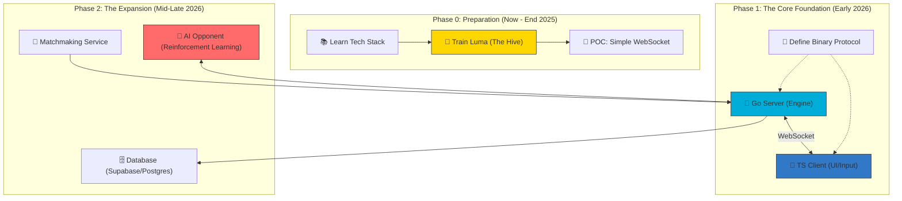

# Architecture & Technical Context

เอกสารนี้อธิบายโครงสร้างระบบ (Technical Architecture) ของ Tetris-Battle หลังจากเปลี่ยน Client เป็น TypeScript

## 🏗 System Architecture (High-Level)

## 📂 Folder Structure (Current Implementation)
*   `src/game/`: Core Game Logic & State (Game.ts, Board.ts, Tetromino.ts)
*   `src/game/GameUI.ts`: DOM-based UI Manager (Menus, Buttons, Scoreboard)
*   `src/game/Renderer.ts`: Canvas Rendering System
*   `src/pwa/`: Progressive Web App (Service Worker) configuration
*   `server/`: (Future / Legacy Go Code)

## 🧩 Key Design Decisions
1.  **Separation of Concerns:** Split Game Logic (`Game.ts`) from Rendering (`Renderer.ts`) and UI (`GameUI.ts`).
2.  **Hybrid Rendering:** Use Canvas for the Game Board (High Performance) and DOM/HTML for UI Overlays (Accessibility, Styling).
3.  **PWA First:** Designed for offline capability and installability on mobile devices.
1.  **Separation of Concerns:** แยก Game Logic ออกจาก Rendering 100% เพื่อให้เขียน Unit Test ง่าย (TDD)
2.  **Game Loop:** ใช้ `requestAnimationFrame` สำหรับ Render Loop และ Fixed Time Step สำหรับ Physics/Logic Loop
3.  **State Management:** สถานะของเกม (Board, Queue, Score) จะถูกเก็บใน State Object กลาง เพื่อให้ง่ายต่อการ Sync กับ Server
4.  **Phase 1:** Basic multiplayer รัน Server ในตัวเว็บได้เลย ยังไม่ต้อง connect dedicated server, รองรับ load users ไม่ต้องเยอะ
5.  **Phase 2:** Advanced multiplayer ต้อง connect dedicated server, รองรับ load users ได้เยอะๆ

