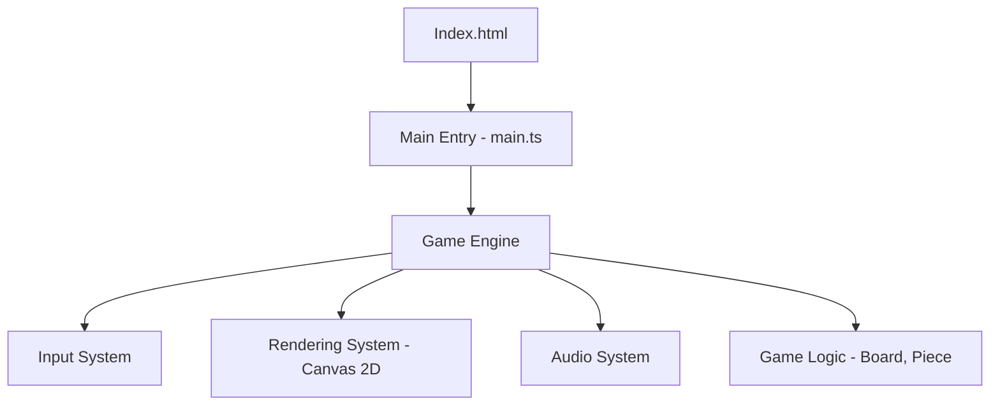

# High-Level Design (HLD)

## System Architecture
The application will use a component-based structure typical of modern web apps, potentially using a lightweight framework or Vanilla JS/Canvas.

## Module Decomposition

### Game Engine
- `GameLoop`: Manages the requestAnimationFrame cycle.
- `StateManager`: Handles states (Menu, Playing, GameOver).

### Rendering
- `Renderer`: Wrapper around Canvas API.
- `SpriteManager`: Handles texture loading (if any).

### Input
- `InputManager`: Maps implementation-specific events (keydown) to Game Actions (MoveLeft, Rotate).
